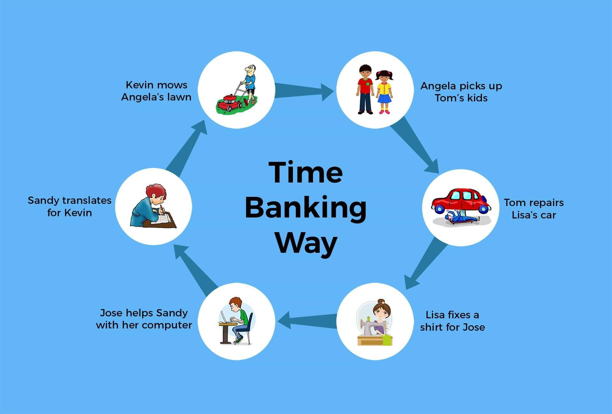

# ## Introduction
Timebanking is a method of sharing abilities without the need of money.You can do what you want, when you want, using timebanking... and receive some support when you need it. 

You can get an hour back from your time bank for every hour you spend assisting someone.

 
